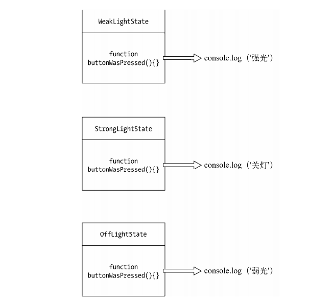
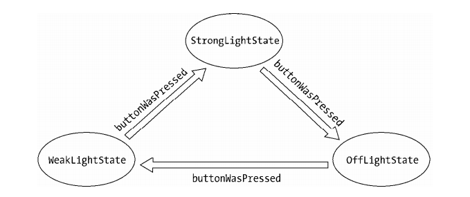
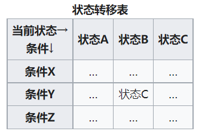

# 前言

Peter Norvig 曾说，设计模式是对语言不足的补充，如果要使用设计模式，不如去找一门更好的语言。对于前端工程师来说，短时间内javascript还是不可替代的工具。为此我们有必要了解几大设计模式在js开发中的应用。

# 设计模式

## 单例模式

### 定义

保证一个类仅有一个实例，并提供一个访问它的全局访问点。

### 场景

开发中，有一些对象我们只需要一次，例如线程池，全局缓存，浏览器window对象等，在JavaScript开发中，比如我们点击登录按钮会弹窗，多次点击这个弹窗也只会被创建一次，此时这个弹窗就适合用单例模式实现。

### JavaScript中的单例模式

#### 全局对象

单例模式的核心是确保只有一个实例，并提供全局访问。全局对象并不是单例模式，但在JavaScript中，常常会把全局对象用作单例模式使用。

但是全局变量会导致很多问题，最明显的比如：命名污染以及被覆盖。

在开发中，我们应该尽量减少使用全局变量，如果非要使用，可以用下面方法将命名污染概率降到最低：

1. 使用命名空间

	适当使用命名空间并不会杜绝全局变量，但是可以减少全局变量的数量，并且可以减少内部变量与全局打交道的机会：

```javascript
const namespace1 = {
  a: {},
  b: {}
}
```

	动态创建命名空间

```javascript
const myApp = {}

myApp.namespace = function(name) {
  const parts = name.split('.')

  let current = myApp

  parts.forEach(key => {
    if (!current[key]) {
      current[key] = {}
      current = current[key]
    }
  });

}

myApp.namespace('event')
myApp.namespace('dom.style')
```

上述代码等价于：

```javascript
const myApp = {
  event: {},
  dom: {
    style: {}
  }
}
```

2. 使用闭包封装私有变量

```javascript
const user = (() => {
  const __name = 'darren',
    __age = 23

  return {
    getUserInfo: function() {
      return __name + '-' + __age
    }
  }
})()
```

#### 惰性单例

惰性单例指的是在需要的时候才创建对象实例。惰性单例是单例模式的重点，这种技术在实际开发中非常有用。下面是通用单例的默认实现：

```javascript
const getSingle = function (fn) {
  let result
  return function () {
    return result || (result = fn.apply(this, arguments))
  }
}
```

### 小结

单例模式是一种简单但非常实用的模式，特别是惰性单例技术，在合适的时候才创建对象，并且只创建唯一的一个。更奇妙的
是，创建对象和管理单例的职责被分布在两个不同的方法中，这两个方法组合起来才具有单例模式的威力。

## 策略模式

### 定义

定义一系列的算法，把它们一个个封装起来，并且使它们可以相互替换。

### 场景

现实中我们达成一件事往往有多种方案，比如去旅游，我们可以选择坐飞机，坐火车或者开汽车，他们之间是可以替代的，只是使用的条件不同。在开发中，也有很多这样的场景，比如压缩文件可以选择gzip算法，也可以选择zip算法。

### JavaScript实现

将不变的部分和变化的部分隔开是每个设计模式的主题，策略模式也不例外，策略模式的目的就是**将算法的使用与算法的实现分离开来**。

分为两部分：

- 策略类：封装具体算法和计算过程
- 环境类：接收用户请求，并将请求委托给某一策略类
  
  下面我们用一个按照不同绩效计算奖金的例子来实现一下：
  ```javascript
  const strategies = {
    "S": function (salary) {
      return salary * 4;
    },
    "A": function (salary) {
      return salary * 3;
    },
    "B": function (salary) {
      return salary * 2;
    }
  };
  const calculateBonus = function (level, salary) {
    return strategies[level](salary);
  };
  ```

**在JavaScript，函数为一等公民，策略模式往往是是隐形的，strategy 就是值为函数的变量。**

比如上面的例子我们可以这么写：

```javascript
const S = function (salary) {
  return salary * 4;
};
const A = function (salary) {
  return salary * 3;
};
const B = function (salary) {
  return salary * 2;
};
const calculateBonus = function (func, salary) {
  return func(salary);
};
calculateBonus(S, 10000); // 输出：40000
```

我们要能认出它还是一个策略模式。

### 小结

策略模式在开发中经常应用，我们来总结下策略模式的优缺点：

优点：

- 利用组合、委托和多态等技术和思想，可以有效地避免多重条件选择语句。
- 提供了对开放—封闭原则的完美支持，将算法封装在独立的 strategy 中，使得它们易于切换，易于理解，易于扩展。
- 策略模式中的算法也可以复用在系统的其他地方，从而避免许多重复的复制粘贴工作。
- 在策略模式中利用组合和委托来让 Context 拥有执行算法的能力，这也是继承的一种更轻
便的替代方案。

缺点：

- 要使用策略模式，必须了解所有的 strategy，必须了解各个 strategy 之间的不同点，这样才能选择一个合适的 strategy。这其实是违反最少知识原则的。

## 代理模式

### 定义

代理模式是为一个对象提供一个代用品或占位符，以便控制对它的访问。

### 场景

代理模式的关键是，当客户不方便直接访问一个对象或者不满足需要的时候，提供一个替身对象来控制对这个对象的访问，客户实际上访问的是替身对象。替身对象对请求做出一些处理之后，再把请求转交给本体对象。

### 保护代理和虚拟代理

提供一个代理对象隔离对真正对象的访问，分为：

- 保护代理：代理对象帮助被代理对象过滤不满足条件的请求
- 虚拟代理：对于开销很大的动作，通过代理对象延迟到真正需要的时候再执行
  ```javascript
  // 通过代理对象在图片未加载完全时显示loading
  const myImage = (function () {
  const imgNode = document.createElement('img');
  document.body.appendChild(imgNode);
  return {
    setSrc: function (src) {
      imgNode.src = src;
    }
  }
  })();
  const proxyImage = (function () {
  const img = new Image;
  img.onload = function () {
    myImage.setSrc(this.src);
  }
  return {
    setSrc: function (src) {
      myImage.setSrc('./images/loading.gif');
      img.src = src;
    }
  }
  })();
  proxyImage.setSrc('https://cdn.pixabay.com/photo/2021/09/08/15/24/couple-6607143_960_720.jpg');
  ```
  
  虽然通过如下的单一对象也可以实现以上功能，但这违反了单一职责原则和开放封闭原则。假如某时网速够快不需要loading功能或者对老项目进行改造添加loading功能，通过使用代理以上需求都能非常方便的实现。
  ```javascript
  const MyImage = (function () {
  const imgNode = document.createElement('img');
  document.body.appendChild(imgNode);
  const img = new Image;
  img.onload = function () {
    imgNode.src = img.src;
  };
  return {
    setSrc: function (src) {
      imgNode.src = './images/loading.gif';
      img.src = src;
    }
  }
  })();
  MyImage.setSrc('https://cdn.pixabay.com/photo/2021/09/08/15/24/couple-6607143_960_720.jpg');
  ```

### 代理和本体接口的一致性

保持代理对用户透明有两点好处：

- 用户可以毫无顾忌的请求代理，只需关心是否得到想要的结果
- 任何使用本体的地方都可以放心的更换为代理

如果代理对象和本体对象都为一个函数（函数也是对象），函数必然都能被执行，则可以认为它们也具有一致的“接口”：

```javascript
const myImage = (function () {
  const imgNode = document.createElement('img');
  document.body.appendChild(imgNode);
  return function (src) {
    imgNode.src = src;
  }
})();
const proxyImage = (function () {
  const img = new Image;
  img.onload = function () {
    myImage(this.src);
  }
  return function (src) {
    myImage('file:// /C:/Users/svenzeng/Desktop/loading.gif');
    img.src = src;
  }
})();
proxyImage('http:// imgcache.qq.com/music// N/k/000GGDys0yA0Nk.jpg');
```

### 虚拟代理合并 HTTP 请求

收集一段时间内的事件，集中请求服务器，减轻服务器压力

```javascript
function synchronousFile(id) {
  console.log('开始同步文件，id 为: ' + id)
  setTimeout(() => {
    console.log('文件同步成功，id 为: ' + id)
  }, 2000)
}

const proxySynchronousFile = (function() {
  let cache = [],
    timer = null;
  
  return function(id) {
    cache.push(id)

    if (timer) return

    timer = setTimeout(() => {
      synchronousFile(cache.join(','))
      clearTimeout(timer)
      timer = null
      cache = []
    }, 2000)
  }

})()

const checkBoxs = document.getElementsByTagName('input')
for (let i = 0, c; c = checkBoxs[i++];) {
  c.onclick = function() {
    if (this.checked === true) {
      proxySynchronousFile(this.id)
    }
  }
}
```

### 虚拟代理在惰性加载中的作用

在某种情况下，我们的js可能很大，不适合随页面加载，但我们又希望js中的API可供用户提前调用。比如下面的例子，虚拟控制台只在用户按下F2时才弹出。在这之前，我们希望用户可以不受影响的调用控制台的API，这时候就可以利用虚拟代理将调用缓存，等到用户主动呼出控制台时再真正的加载。

```jsavascript
const miniConsole = (function () {
  const cache = [];
  const handler = function (ev) {
    if (ev.keyCode === 113) {
      const script = document.createElement('script');
      script.onload = function () {
        for (let i = 0, fn; fn = cache[i++];) {
          fn();
        }
      };
      script.src = 'miniConsole.js';
      document.getElementsByTagName('head')[0].appendChild(script);
      document.body.removeEventListener('keydown', handler);// 只加载一次 miniConsole.js 
    }
  };
  document.body.addEventListener('keydown', handler, false);
  return {
    log: function () {
      const args = arguments;
      cache.push(function () {
        return miniConsole.log.apply(miniConsole, args);
      });
    }
  }
})();
miniConsole.log(11); // 开始打印 log 
// miniConsole.js 代码
miniConsole = {
  log: function () {
    // 真正代码略
    console.log(Array.prototype.join.call(arguments));
  }
};
```

### 缓存代理

缓存代理可以为一些开销大的运算结果提供暂时的存储，在下次运算时，如果传递进来的参数跟之前一致，则可以直接返回前面存储的运算结果。

例如计算乘积:

```javascript
const mult = function () {
  console.log('初次计算乘积');
  let a = 1;
  for (var i = 0, l = arguments.length; i < l; i++) {
    a = a * arguments[i];
  }
  return a;
};

const proxyMult = (function() {
  const cache = {}
  return function() {
    const args = Array.prototype.join.call(arguments, ',')
    if (cache[args]) return cache[args]
    return cache[args] = mult.apply(this, arguments)
  }
})()
```

在页面中做大数据量的分页加载时，也可以将以获取的数据缓存。

对于不同用途的函数，我们可以用工厂函数创建对应的代理函数：

```javascript
const createProxyFactory = function (fn) {
  const cache = {};
  return function () {
    const args = Array.prototype.join.call(arguments, ',');
    if (args in cache) return cache[args];
    return cache[args] = fn.apply(this, arguments);
  }
};
```

### 小结

代理模式包括许多小分类，在 JavaScript 开发中最常用的是虚拟代理和缓存代理。虽然代理模式非常有用，但我们在编写业务代码的时候，往往不需要去预先猜测是否需要使用代理模式。当真正发现不方便直接访问某个对象的时候，再编写代理也不迟。

## 迭代器模式

### 定义

迭代器模式是指提供一种方法顺序访问一个聚合对象中的各个元素，而又不需要暴露该对象的内部表示。迭代器模式可以把迭代的过程从业务逻辑中分离出来，在使用迭代器模式之后，即使不关心对象的内部构造，也可以按顺序访问其中的每个元素。

### 场景

在js中， 只要被迭代的聚合对象拥有 length 属性而且可以用下标访问，那它就可以被迭代。

迭代器又分为内部迭代器和外部迭代器：

- 内部迭代器在调用的时候非常方便，外界不用关心迭代器内部的实现，跟迭代器的交互也仅仅是一次初始调用，但这也刚好是内部迭代器的缺点。

- 外部迭代器必须显式地请求迭代下一个元素。这增加了一些调用的复杂度，但相对也增强了迭代器的灵活性，我们可以手工控制迭代的过程或者顺序。
  
  实现一个外部迭代器：
  ```javascript
  const Iterator = function (obj) {
    let current = 0;
    const next = function () {
      current += 1;
    };
    const isDone = function () {
      return current >= obj.length;
    };
    const getCurrItem = function () {
      return obj[current];
    };
    return {
      next: next,
      isDone: isDone,
      getCurrItem: getCurrItem
    }
  };
  ```

### 倒叙迭代

```javascript
const reverseEach = function(ary, callback) {
  for (let l = ary.length; l >= 0; l--) {
    callback( l, ary[ l ] );
  }
}
```

### 终止迭代器

在自己实现的迭代器中，最好可以像普通 for 循环中的 break 一样，提供一种跳出循环的方法。

例如下面例子约定在callback执行返回false时终止循环：

```javascript
const each = function (ary, callback) {
  for (let i = 0, l = ary.length; i < l; i++) {
    if (callback(i, ary[i]) === false) { // callback 的执行结果返回 false，提前终止迭代
      break;
    }
  }
};
```

### 迭代器模式在开发中的应用

在有多个备选对象时，我们往往使用if /else来进行条件判断，例如下面根据宿主浏览器选择上传对象的力例子：

```javascript
const getUploadObj = function () {
  try {
    return new ActiveXObject("TXFTNActiveX.FTNUpload"); // IE 上传控件
  } catch (e) {
    if (supportFlash()) { // supportFlash 函数未提供
      const str = '<object type="application/x-shockwave-flash"></object>';
      return $(str).appendTo($('body'));
    } else {
      const str = '<input name="file" type="file"/>'; // 表单上传
      return $(str).appendTo($('body'));
    }
  }
};
```

这样的写法缺点显而易见，在备选项过多的情况下`getUploadObj`函数会充斥着`try catch`

以及`if else`，影响可读性而且也违反了开放封闭原则，不利于后期的扩展。

在这种场景中，我们可以把每种获取 upload 对象的方法都封装在各自的函数里，约定获取失败时返回false，然后使用一个迭代器，在返回false时继续迭代，直到获取到一个可用的为止：

```javascript
const getActiveUploadObj = function () {
  try {
    return new ActiveXObject("TXFTNActiveX.FTNUpload"); // IE 上传控件
  } catch (e) {
    return false;
  }
};
const getFlashUploadObj = function () {
  if (supportFlash()) { // supportFlash 函数未提供
    const str = '<object type="application/x-shockwave-flash"></object>';
    return $(str).appendTo($('body'));
  }
  return false;
};
const getFormUpladObj = function () {
  const str = '<input name="file" type="file" class="ui-file"/>'; // 表单上传
  return $(str).appendTo($('body'));
};

// 迭代器
const iteratorUploadObj = function () {
  for (let i = 0, fn; fn = arguments[i++];) {
    const uploadObj = fn();
    if (uploadObj !== false) {
      return uploadObj;
    }
  }
};
const uploadObj = iteratorUploadObj(getActiveUploadObj, getFlashUploadObj, getFormUpladObj);
```

在后续添加新的上传方式时，我们只需实现各自的方法，并且按优先级传入迭代器。

### 小结

迭代器模式是一种相对简单的模式，简单到很多时候我们都不认为它是一种设计模式。目前的绝大部分语言都内置了迭代器。

## 发布-订阅模式（观察者模式）

### 定义

发布-订阅模式又叫观察者模式，它定义对象间的一种一对多的依赖关系，当一个对象的状态发生改变时，所有依赖于它的对象都将得到通知。在 JavaScript 开发中，我们一般用事件模型来替代传统的发布—订阅模式

### 现实中的发布-订阅模式

不论是在程序世界里还是现实生活中，发布—订阅模式的应用都非常之广泛。我们先看一个现实中的例子。
小明最近看上了一套房子，到了售楼处之后才被告知，该楼盘的房子早已售罄。好在售楼MM 告诉小明，不久后还有一些尾盘推出，开发商正在办理相关手续，手续办好后便可以购买。但到底是什么时候，目前还没有人能够知道。于是小明记下了售楼处的电话，以后每天都会打电话过去询问是不是已经到了购买时间。除了小明，还有小红、小强、小龙也会每天向售楼处咨询这个问题。一个星期过后，售楼 MM 决定辞职，因为厌倦了每天回答 1000 个相同内容的电话。
当然现实中没有这么笨的销售公司，实际上故事是这样的：小明离开之前，把电话号码留在了售楼处。售楼 MM 答应他，新楼盘一推出就马上发信息通知小明。小红、小强和小龙也是一样，他们的电话号码都被记在售楼处的花名册上，新楼盘推出的时候，售楼 MM 会翻开花名册，
遍历上面的电话号码，依次发送一条短信来通知他们。

### 发布-订阅模式的作用

通过上面的例子，我们可以发现此模式显而易见的优点：

- 首先，购房者不用每天浪费时间打电话到售楼处询问，只需等待开售时售楼处的电话。
- 其次，售楼处和顾客实现了解绑，当有新的购房客时只需在售楼处留下电话号码，客服MM不用每天接到没用的电话，也不用关心客户是人是鬼，只需在合适时间打电话通知即可。

第一点说明发布订阅模式适合于**异步编程**的场景。这是一种替代传统异步**回调函数**的情况。无需过多关注异步行为执行的过程，只需关注感兴趣的事件发生点。

第二点说明发布—订阅模式可以取代对象之间硬编码的通知机制，一个对象不用再显式地调用另外一个对象的某个接口。发布—订阅模式让两个对象松耦合地联系在一起，虽然不太清楚彼此的细节，但这不影响它们之间相互通信。当有新的订阅者出现时，发布者的代码不需要任何修
改；同样发布者需要改变时，也不会影响到之前的订阅者。只要之前约定的事件名没有变化，就可以自由地改变它们。

### DOM事件

这是发布订阅模式在前端开发中最常用的场景：

```javascript
document.body.addEventListener( 'click', function(){ 
 alert(2); 
}, false );
```

我们无法预知客户什么时候会点击页面，所以我们订阅 document.body 上的 click 事件，当 body 节点被点击时，body 节点便会向订阅
者发布这个消息，并执行我们预设的回调。

### 自定义事件

除了DOM事件，在开发中我们常会自定义一些事件，这种依靠自定义事件的发布订阅模式可以应用于任何场景中。

**如何一步步实现发布-订阅模式：**

- 首先指定发布者（售楼处）
- 然后给发布者添加一个缓存列表（电话簿），用于存放订阅者（购房客）的回调函数（电话）以便通知订阅者
- 最后发布消息时，发布者遍历缓存列表依次执行回调（电话通知购房客）

<br/>

另外，我们可以给回调函数添加一些参数来给订阅者接收，这是很有必要的，比如售楼处可以在发给订阅者的短信里加上房子的单价、面积、容积率等信息，订阅者接收到这些信息之后可以进行各自的处理：

```javascript
const salesOffices = {}; // 定义售楼处

salesOffices.clientList = []; // 缓存列表，存放订阅者的回调函数

salesOffices.listen = function (fn) { // 增加订阅者
  this.clientList.push(fn); // 订阅的消息添加进缓存列表
};

salesOffices.trigger = function () { // 发布消息
  for (let i = 0, fn; fn = this.clientList[i++];) {
    fn.apply(this, arguments); // (2) // arguments 是发布消息时带上的参数
  }
};

salesOffices.listen(function (price, squareMeter) { // 小明订阅消息
  console.log('价格= ' + price);
  console.log('squareMeter= ' + squareMeter);
});
salesOffices.listen(function (price, squareMeter) { // 小红订阅消息
  console.log('价格= ' + price);
  console.log('squareMeter= ' + squareMeter);
});
salesOffices.trigger(2000000, 88); // 输出：200 万，88 平方米
salesOffices.trigger(3000000, 110); // 输出：300 万，110 平方米
```

但是上面的实现有个缺点，小明只想要88平的房子，结果110平的价格也推给了他，类似的小红只想要110平的也收到了88平的价格，即没有实现分类订阅。为此我们修改一下：

```javascript
const salesOffices = {}; // 定义售楼处

salesOffices.clientList = {}; // 缓存列表，存放订阅者的回调函数

salesOffices.listen = function (key, fn) { // 增加订阅者
  if (!this.clientList[key])
    this.clientList[key] = []
  this.clientList[key].push(fn)
};

salesOffices.trigger = function () { 
  const key = Array.prototype.shift.call(arguments) // key: 消息类型

  const fns = this.clientList[key]

  if (!fns.length) return

  for (let i = 0, fn; fn = fns[i++];) {
    fn.apply(this, arguments); // arguments 是发布消息时带上的参数
  }
};

salesOffices.listen( 'squareMeter88', function( price ){ // 小明订阅 88 平方米房子的消息
 console.log( '价格= ' + price ); // 输出： 2000000 
}); 

salesOffices.listen( 'squareMeter110', function( price ){ // 小红订阅 110 平方米房子的消息
 console.log( '价格= ' + price ); // 输出： 3000000 
});

salesOffices.trigger( 'squareMeter88', 2000000 ); // 发布 88 平方米房子的价格
salesOffices.trigger( 'squareMeter110', 3000000 ); // 发布 110 平方米房子的价格
```

### 发布-订阅模式的通用实现

现在我们已经看到了如何让售楼处拥有接受订阅和发布事件的功能。假设现在小明又去另一个售楼处买房子，那么这段代码是否必须在另一个售楼处对象上重写一次呢，有没有办法可以让所有对象都拥有发布—订阅功能呢？
答案显然是有的，JavaScript 作为一门解释执行的语言，给对象动态添加职责是理所当然的事情。
所以我们把发布—订阅的功能提取出来，放在一个单独的对象内：

```javascript
const event = {
  clientList: [],
  listen: function (key, fn) {
    if (!this.clientList[key]) {
      this.clientList[key] = [];
    }
    this.clientList[key].push(fn); // 订阅的消息添加进缓存列表
  },
  trigger: function () {
    const key = Array.prototype.shift.call(arguments), // (1); 
      fns = this.clientList[key];
    if (!fns || fns.length === 0) { // 如果没有绑定对应的消息
      return false;
    }
    for (let i = 0, fn; fn = fns[i++];) {
      fn.apply(this, arguments); // (2) // arguments 是 trigger 时带上的参数
    }
  }
};
```

接下来我们再定义一个install函数:

```javascript
const installEvent = function (obj) {
  for (let i in event) {
    obj[i] = event[i];
  }
};
```

测试:

```javascript
const salesOffices = {};

installEvent( salesOffices );

salesOffices.listen( 'squareMeter88', function( price ){ // 小明订阅消息
 console.log( '价格= ' + price ); 
}); 
salesOffices.listen( 'squareMeter100', function( price ){ // 小红订阅消息
 console.log( '价格= ' + price ); 
}); 

salesOffices.trigger( 'squareMeter88', 2000000 ); // 输出：2000000 
salesOffices.trigger( 'squareMeter100', 3000000 ); // 输出：3000000
```

### 取消订阅

有时候，我们也许需要取消订阅事件的功能。比如小明突然不想买房子了，为了避免继续接收到售楼处推送过来的短信，小明需要取消之前订阅的事件。现在我们给 observer 对象增加 remove方法：

```javascript
event.remove = function (key, fn) {
  const fns = this.clientList[key];
  if (!fns) { // 如果 key 对应的消息没有被人订阅，则直接返回
    return false;
  }
  if (!fn) { // 如果没有传入具体的回调函数，表示需要取消 key 对应消息的所有订阅
    fns && (fns.length = 0);
  } else {
    for (let l = fns.length - 1; l >= 0; l--) { // 反向遍历订阅的回调函数列表
      const _fn = fns[l];
      if (_fn === fn) {
        fns.splice(l, 1); // 删除订阅者的回调函数
      }
    }
  }
};
```

### 全局的发布-订阅

回想下刚刚实现的发布—订阅模式，我们给售楼处对象和登录对象都添加了订阅和发布的功能，这里还存在两个小问题：

- 我们给每个发布对象都实现了`clientList`以及`listen, trigger`方法，这其实是一种资源浪费
- 订阅者和发布者之间还存在着一定的耦合，订阅者首先要知道发布对象的名字才能顺利订阅事件

在真实场景中，购房者往往不需要亲自前往售楼处，而是通过中介查询房源，中介负责通知购房者价格的变动。由此我们可以实现一个类似中介的全局发布订阅对象：

```javascript
const EventBus = (function () {
  const clientList = {};
  let listen,
    trigger,
    remove;

  listen = function (key, fn) {
    if (!clientList[key]) {
      clientList[key] = [];
    }
    clientList[key].push(fn);
  };

  trigger = function () {
    const key = Array.prototype.shift.call(arguments),
      fns = clientList[key];
    if (!fns || fns.length === 0) {
      return false;
    }
    for (let i = 0, fn; fn = fns[i++];) {
      fn.apply(this, arguments);
    }
  };

  remove = function (key, fn) {
    const fns = clientList[key];
    if (!fns) {
      return false;
    }
    if (!fn) {
      fns && (fns.length = 0);
    } else {
      for (let l = fns.length - 1; l >= 0; l--) {
        var _fn = fns[l];
        if (_fn === fn) {
          fns.splice(l, 1);
        }
      }
    }
  };

  return {
    listen: listen,
    trigger: trigger,
    remove: remove
  }
})();

EventBus.listen('squareMeter88', function (price) { // 小红订阅消息
  console.log('价格= ' + price); // 输出：'价格=2000000' 
});

EventBus.trigger('squareMeter88', 2000000); // 售楼处发布消息
```

这样我们就实现了类似Vue中的事件总线eventBus。

### 必须先订阅再发布吗？

我们所了解到的发布—订阅模式，都是订阅者必须先订阅一个消息，随后才能接收到发布者发布的消息。如果把顺序反过来，发布者先发布一条消息，而在此之前并没有对象来订阅它，这条消息无疑将消失在宇宙中。

这种需求在实际项目中是存在的，比如在之前的商城网站中，获取到用户信息之后才能渲染用户导航模块，而获取用户信息的操作是一个 ajax 异步请求。当 ajax 请求成功返回之后会发布一个事件，在此之前订阅了此事件的用户导航模块可以接收到这些用户信息。
但是这只是理想的状况，因为异步的原因，我们不能保证 ajax 请求返回的时间，有时候它返回得比较快，而此时用户导航模块的代码还没有加载好（还没有订阅相应事件），特别是在用了一些模块化惰性加载的技术后，这是很可能发生的事情。也许我们还需要一个方案，使得我们的
发布—订阅对象拥有先发布后订阅的能力。

为了满足这个需求，我们要建立一个存放离线事件的堆栈，当事件发布的时候，如果此时还没有订阅者来订阅这个事件，我们暂时把发布事件的动作包裹在一个函数里，这些包装函数将被存入堆栈中，等到终于有对象来订阅此事件的时候，我们将遍历堆栈并且依次执行这些包装函数，
也就是重新发布里面的事件。当然离线事件的生命周期只有**一次**，就像 QQ 的未读消息只会被重新阅读一次，所以刚才的操作我们只能进行一次。

### 命名冲突

全局的发布—订阅对象里只有一个 clinetList 来存放消息名和回调函数，大家都通过它来订阅和发布各种消息，久而久之，难免会出现事件名冲突的情况，所以我们还可以给 Event 对象提供创建命名空间的功能。

接下来来实现上买你说的两个功能：

```javascript
var Event = (function () {
  var global = this,
    _default = 'default';
  return function () {
    var _listen,
      _trigger,
      _remove,
      _slice = Array.prototype.slice,
      _shift = Array.prototype.shift,
      _unshift = Array.prototype.unshift,
      namespaceCache = {},
      _create,
      find,
      each = function (ary, fn) {
        var ret;
        for (var i = 0, l = ary.length; i < l; i++) {
          var n = ary[i];
          ret = fn.call(n, i, n);
        }
        return ret;
      };
    _listen = function (key, fn, cache) {
      if (!cache[key]) {
        cache[key] = [];
      }
      cache[key].push(fn);
    };
    _remove = function (key, cache, fn) {
      if (cache[key]) {
        if (fn) {
          for (var i = cache[key].length; i >= 0; i--) {
            if (cache[key][i] === fn) {
              cache[key].splice(i, 1);
            }
          }
        } else {
          cache[key] = [];
        }
      }
    };
    _trigger = function () {
      var cache = _shift.call(arguments),
        key = _shift.call(arguments),
        args = arguments,
        _self = this,
        ret,
        stack = cache[key];
      if (!stack || !stack.length) {
        return;
      }
      return each(stack, function () {
        return this.apply(_self, args);
      });
    };
    _create = function (namespace) {
      var namespace = namespace || _default;
      var cache = {},
        offlineStack = [], // 离线事件 
        ret = {
          listen: function (key, fn, last) {
            _listen(key, fn, cache);
            if (offlineStack === null) {
              return;
            }
            if (last === 'last') {
              offlineStack.length && offlineStack.pop()();
            } else {
              each(offlineStack, function () {
                this();
              });
            }
            offlineStack = null;
          },
          one: function (key, fn, last) {
            _remove(key, cache);
            this.listen(key, fn, last);
          },
          remove: function (key, fn) {
            _remove(key, cache, fn);
          },
          trigger: function () {
            var fn,
              args,
              _self = this;
            _unshift.call(arguments, cache);
            args = arguments;
            fn = function () {
              return _trigger.apply(_self, args);
            };
            if (offlineStack) {
              return offlineStack.push(fn);
            }
            return fn();
          }
        };
      return namespace ?
        (namespaceCache[namespace] ? namespaceCache[namespace] :
          namespaceCache[namespace] = ret)
        : ret;
    };
    return {
      create: _create,
      one: function (key, fn, last) {
        var event = this.create();
        event.one(key, fn, last);
      },
      remove: function (key, fn) {
        var event = this.create();
        event.remove(key, fn);
      },
      listen: function (key, fn, last) {
        var event = this.create();
        event.listen(key, fn, last);
      },
      trigger: function () {
        var event = this.create();
        event.trigger.apply(this, arguments);
      }
    };
  }();
})();

Event.create('namespace1').listen('click', function (a) {
  console.log(a); // 输出：1 
});
Event.create('namespace1').trigger('click', 1);
```

### 小结

发布-订阅模式的优点非常明显，一为时间上的解耦，二为对象之间的解耦。它的应用非常广泛，既可以用在异步编程中，也可以帮助我们完成更松耦合的代码编写。发布—订阅模式还可以用来帮助实现一些别的设计模式，比如中介者模式。从架构上来看，无论是 MVC 还是 MVVM，都少不了发布—订阅模式的参与，而且 JavaScript 本身也是一门基于事件驱动的语言。 
当然，发布—订阅模式也不是完全没有缺点。创建订阅者本身要消耗一定的时间和内存，而且当你订阅一个消息后，也许此消息最后都未发生，但这个订阅者会始终存在于内存中。另外，发布—订阅模式虽然可以弱化对象之间的联系，但如果过度使用的话，对象和对象之间的必要联系也将被深埋在背后，会导致程序难以跟踪维护和理解。特别是有多个发布者和订阅者嵌套到一起的时候，要跟踪一个 bug 不是件轻松的事情。

## 命令模式

### 定义

命令模式是最简单和优雅的模式之一，命令模式中的命令（command）指的是一个执行某些特定事情的指令。

### 场景

命令模式最常见的应用场景是：有时候需要向某些对象发送请求，但是并不知道请求的接收者是谁，也不知道被请求的操作是什么。此时希望用一种松耦合的方式来设计程序，使得请求发送者和请求接收者能够消除彼此之间的耦合关系。

就像点外卖一样，顾客的订单在命令模式中可以被封装为command对象，这个对象可以四处传递，最后交给某位厨师处理。厨师不需要知道顾客的任何信息，客人也不需要知道厨师的名字，这样客户与厨师之间就实现了解耦。

命令模式还支持撤销，排队等操作。

### 实例

<br/>

## 组合模式

TODO

## 模板方法模式

在 JavaScript 开发中用到继承的场景其实并不是很多，很多时候我们都喜欢用 mix-in 的方式给对象扩展属性。但这不代表继承在 JavaScript 里没有用武之地，虽然没有真正的类和继承机制，但我们可以通过原型 prototype 来变相地实现继承。
不过本章并非要讨论继承，而是讨论一种基于继承的设计模式——模板方法（Template Method）模式。

TODO

## 享元模式

享元（flyweight）模式是一种用于性能优化的模式，“fly”在这里是苍蝇的意思，意为蝇量级。享元模式的核心是运用共享技术来有效支持大量细粒度的对象。在创建了大量相似对象而导致内存占用过高时非常有用。

### 内部状态和外部状态

我们先开看一个文件上传的例子：

```javascript
// uploadType: 上传控件
const Upload = function (uploadType, fileName, fileSize) {
  this.uploadType = uploadType;
  this.fileName = fileName;
  this.fileSize = fileSize;
  this.dom = null;
}

Upload.prototype.init = function (id) {
  this.id = id;
  this.dom = document.createElement('div');
  this.dom.innerHTML =
    '<span>文件名称:' + this.fileName + ', 文件大小: ' + this.fileSize + '</span>' +
    '<button class="delFile">删除</button>';
  this.dom.querySelector('.delFile').onclick = () => {
    this.delFile()
  }
  document.body.appendChild(this.dom);
}

Upload.prototype.delFile = function () {
  if (this.fileSize < 3000) {
    return this.dom.parentNode.removeChild(this.dom);
  }
  if (window.confirm('确定要删除该文件吗? ' + this.fileName)) {
    return this.dom.parentNode.removeChild(this.dom);
  }
}

let id = 0;
window.startUpload = function (uploadType, files) { // uploadType 区分是控件还是 flash 
  for (let i = 0, file; file = files[i++];) {
    const uploadObj = new Upload(uploadType, file.fileName, file.fileSize);
    uploadObj.init(id++); // 给 upload 对象设置一个唯一的 id 
  }
};

// 分别创建3个插件上传对象和3个flash上传对象
startUpload('plugin', [
  {
    fileName: '1.txt',
    fileSize: 1000
  },
  {
    fileName: '2.html',
    fileSize: 3000
  },
  {
    fileName: '3.txt',
    fileSize: 5000
  }
]);
startUpload('flash', [
  {
    fileName: '4.txt',
    fileSize: 1000
  },
  {
    fileName: '5.html',
    fileSize: 3000
  },
  {
    fileName: '6.txt',
    fileSize: 5000
  }
]); 
```

观察上面的例子可以发现，上传多少个文件就创建了多少个Upload对象，这会占用内存对性能产生影响。实际上，在Upload对象中uploadType状态是可以被多个实例共享的。享元模式的目标就是尽可能减少共享对象的数量，即抽离出对象中的内部状态和外部状态：

- 内部状态存储于对象内部
- 内部状态可以被多个对象共享
- 内部对象独立于具体的场景，通常不会变化
- 外部对象取决于具体的场景，并根据场景变化，不能被共享

 下面我们用享元模式对例子进行优化：

```javascript
const Upload = function (uploadType) {
  this.uploadType = uploadType;
}

Upload.prototype.delFile = function (id) {
  uploadManage.setExternalState(id, this);

  if (this.fileSize < 3000) {
    return this.dom.parentNode.removeChild(this.dom);
  }
  if (window.confirm('确定要删除该文件吗? ' + this.fileName)) {
    return this.dom.parentNode.removeChild(this.dom);
  }
}

const uploadObjFactory = (function () {
  const uploadObjPool = {};

  return function (uploadType) {
    if (uploadObjPool[uploadType]) return uploadObjPool[uploadType];

    return uploadObjPool[uploadType] = new Upload(uploadType);
  }
})();

const uploadManage = (function () {
  const uploadDatabase = {};

  return {
    add: (id, uploadType, fileName, fileSize) => {
      const uploadObj = uploadObjFactory(uploadType);

      const dom = document.createElement('div');
      dom.innerHTML =
        '<span>文件名称:' + fileName + ', 文件大小: ' + fileSize + '</span>' +
        '<button class="delFile">删除</button>';
      dom.querySelector('.delFile').onclick = () => {
        uploadObj.delFile(id)
      }
      document.body.appendChild(dom);

      uploadDatabase[id] = {
        fileName,
        fileSize,
        dom
      }

      return uploadObj;
    },
    setExternalState: (id, uploadObj) => {
      const uploadData = uploadDatabase[id];
      console.log(uploadData);
      for (const key in uploadData) {
        uploadObj[key] = uploadData[key];
      }
    }
  }
})();

let id = 0;
window.startUpload = function (uploadType, files) { // uploadType 区分是控件还是 flash 
  for (let i = 0, file; file = files[i++];) {
    uploadManage.add(id++, uploadType, file.fileName, file.fileSize); // 给 upload 对象设置一个唯一的 id 
  }
};

startUpload('plugin', [
  {
    fileName: '1.txt',
    fileSize: 1000
  },
  {
    fileName: '2.html',
    fileSize: 3000
  },
  {
    fileName: '3.txt',
    fileSize: 5000
  }
]);
startUpload('flash', [
  {
    fileName: '4.txt',
    fileSize: 1000
  },
  {
    fileName: '5.html',
    fileSize: 3000
  },
  {
    fileName: '6.txt',
    fileSize: 5000
  }
]);
```

享元模式重构之前的代码里一共创建了 6个 upload 对象，而通过享元模式重构之后，对象的数量减少为 2，更幸运的是， 就算现在同时上传 2000个文件，需要创建的 upload 对象数量依然是 2。

### 享元模式的适用性

享元模式是一种很好的性能优化方案，但它也会带来一些复杂性的问题，从前面两组代码的比较可以看到，使用了享元模式之后，我们需要分别多维护一个 factory 对象和一个 manager 对象，在大部分不必要使用享元模式的环境下，这些开销是可以避免的。

享元模式带来的好处很大程度上取决于如何使用以及何时使用，一般来说，以下情况发生时便可以使用享元模式。

- 程序中使用了大量相似对象
- 大量对象极大占用了内存
- 对象的大多数状态可以变为外部状态
- 抽离外部状态后，可以用相对较少的共享对象取代大量对象

<br/>

## 职责链模式

职责链模式的定义是：使多个对象都有机会处理请求，从而避免请求的发送者和接收者之间的耦合关系，将这些对象连成一条链，并沿着这条链传递该请求，直到有一个对象处理它为止。链中的对象我们称之为节点。

### 现实中的职责链模式

- 早高峰的公交上，如果我们被挤在中间或者距离售票员很远的地方，我们可能会让后面的人帮忙把硬币递到售票员那，在这中间可能经过了n个人。
- 中学时代的期末考试，如果你平时不太老实，考试时就会被安排在第一个位置。遇到不会答的题目，就把题目编号写在小纸条上往后传递，坐在后面的同学如果也不会答，他就会把这张小纸条继续递给他后面的人。

从这两个例子中，我们可以发现职责链模式最大的优点：请求者只需要知道链接中的第一个节点，从而弱化了请求者和接收者之间的强联系。否则我们需要提前知道谁是售票员或者哪个同学会这道题。

### 实际开发中的职责链模式

假设目前有一个售卖手机的电商业务，在经过200元和500元的两轮定金过后，已经到了正式购买阶段。

公司针对支付过定金的用户有一定的优惠政策。在正式购买后，已经支付过 500 元定金的用户会收到 100 元的商城优惠券，200 元定金的用户可以收到 50 元的优惠券，而之前没有支付定金的用户只能进入普通购买模式，也就是没有优惠券，且在库存有限的情况下不一定保证能买到。

页面加载之初前端会收到后端的几个字段，分别是：

- orderType：表示订单类型（定金用户或者普通购买用户），code 的值为 1 的时候是 500 元定金用户，为 2 的时候是 200 元定金用户，为 3 的时候是普通购买用户。
- pay：表示用户是否已经支付定金，值为 true 或者 false, 虽然用户已经下过 500 元定金的订单，但如果他一直没有支付定金，现在只能降级进入普通购买模式。
-  stock：表示当前用于普通购买的手机库存数量，已经支付过 500 元或者 200 元定金的用户不受此限制。

<br/>

```javascript
const order = function (orderType, pay, stock) {
  if (orderType === 1) { // 500 元定金购买模式
    if (pay === true) { // 已支付定金
      console.log('500 元定金预购, 得到 100 优惠券');
    } else { // 未支付定金，降级到普通购买模式
      if (stock > 0) { // 用于普通购买的手机还有库存
        console.log('普通购买, 无优惠券');
      } else {
        console.log('手机库存不足');
      }
    }
  }
  else if (orderType === 2) { // 200 元定金购买模式
    if (pay === true) {
      console.log('200 元定金预购, 得到 50 优惠券');
    } else {
      if (stock > 0) {
        console.log('普通购买, 无优惠券');
      } else {
        console.log('手机库存不足');
      }
    }
  }
  else if (orderType === 3) {
    if (stock > 0) {
      console.log('普通购买, 无优惠券');
    } else {
      console.log('手机库存不足');
    }
  }
};
order(1, true, 500); // 输出： 500 元定金预购, 得到 100 优惠券
```

虽然可以得出正确的结果，但是上面的代码远远称不上好代码。order函数不仅巨大难以阅读而且经常需要修改，后面的维护工作无疑让人头疼。

### 用职责链模式重构代码

现在我们采用职责链模式重构这段代码，先把 500 元订单、200 元订单以及普通购买分成 3个函数。
接下来把 orderType、pay、stock 这 3 个字段当作参数传递给 500 元订单函数，如果该函数不符合处理条件，则把这个请求传递给后面的 200 元订单函数，如果 200 元订单函数依然不能处理该请求，则继续传递请求给普通购买函数，代码如下：

```javascript
const order500 = function (orderType, pay, stock) {
  if (orderType === 1 && pay) { // 500 元定金购买模式
    console.log('500 元定金预购, 得到 100 优惠券');
  } else {
    order200(orderType, pay, stock); // 将请求传递给 200 元订单
  }
}

const order200 = function (orderType, pay, stock) {
  if (orderType === 2 && pay) { // 500 元定金购买模式
    console.log('200 元定金预购, 得到 50 优惠券');
  } else {
    orderNormal(orderType, pay, stock); // 将请求传递给 Normal 订单
  }
}

const orderNormal = function (orderType, pay, stock) {
  if (stock > 0) {
    console.log('普通购买, 无优惠券');
  } else {
    console.log('手机库存不足');
  }
}

order500( 1 , true, 500); // 输出：500 元定金预购, 得到 100 优惠券
order500( 1, false, 500 ); // 输出：普通购买, 无优惠券
order500( 2, true, 500 ); // 输出：200 元定金预购, 得到 500 优惠券
order500( 3, false, 500 ); // 输出：普通购买, 无优惠券
order500( 3, false, 0 ); // 输出：手机库存不足
```

可以看到，执行结果和前面那个巨大的 order 函数完全一样，但是代码的结构已经清晰了很多，我们把一个大函数拆分了 3 个小函数，去掉了许多嵌套的条件分支语句。
目前已经有了不小的进步，但我们不会满足于此，虽然已经把大函数拆分成了互不影响的 3个小函数，但可以看到，请求在链条传中的顺序非常僵硬，传递请求的代码被耦合在了业务函数之中：

```javascript
const order500 = function (orderType, pay, stock) {
  if (orderType === 1 && pay) { // 500 元定金购买模式
    console.log('500 元定金预购, 得到 100 优惠券');
  } else {
    order200(orderType, pay, stock); // order500和order200耦合在一起
  }
}
```

这依然是违反开放封闭原则的，如果哪天我们要去掉500或者200的定金逻辑则要拆散代码，这是我们不想看到的。

### 灵活可拆分的职责链节点

本节我们采用一种更灵活的方式，来改进上面的职责链模式，目标是让链中的各个节点可以灵活拆分和重组。
首先需要改写一下分别表示 3 种购买模式的节点函数，我们约定，如果某个节点不能处理请求，则返回一个特定的字符串 'nextSuccessor'来表示该请求需要继续往后面传递：

```javascript
const order500 = function (orderType, pay, stock) {
  if (orderType === 1 && pay) { // 500 元定金购买模式
    console.log('500 元定金预购, 得到 100 优惠券');
  } else {
    return 'nextSuccessor';
  }
}

const order200 = function (orderType, pay, stock) {
  if (orderType === 2 && pay) { // 500 元定金购买模式
    console.log('200 元定金预购, 得到 50 优惠券');
  } else {
    return 'nextSuccessor';
  }
}

const orderNormal = function (orderType, pay, stock) {
  if (stock > 0) {
    console.log('普通购买, 无优惠券');
  } else {
    console.log('手机库存不足');
  }
}
```

接下来要把节点函数包装进职责链中。我们定义一个Chain构造函数，构造时传递当前要包装的节点函数，同时，Chain还包括一个实例属性successor，代表下一个节点：

```javascript
function Chain(fn) {
  this.fn = fn;
  this.successor = null;
}
```

Chain还有两个原型方法：setNextSuccessor和passRequest，分别用来指定下一个节点以及传递请求给下一个节点：

```javascript
Chain.prototype.setSuccessor = function (successor) {
  return this.successor = successor;
}
Chain.prototype.passRequest = function() {
  const ret = this.fn.apply(this, arguments);

  if (ret === 'nextSuccessor') {
    return this.successor && this.successor.passRequest.apply(this.successor, arguments);
  }

  return ret;
}
```

接下来我们用Chain包装节点函数:

```javascript
const chainOrder500 = new Chain(order500);
const chainOrder200 = new Chain(order200);
const chainOrderNormal = new Chain(orderNormal);
```

设置节点顺序:

```javascript
chainOrder500.setSuccessor(chainOrder200);
chainOrder200.setSuccessor(chainOrderNormal);
```

接着将请求传递给首个节点:

```javascript
chainOrder500.passRequest( 1, true, 500 ); // 输出：500 元定金预购，得到 100 优惠券
chainOrder500.passRequest( 2, true, 500 ); // 输出：200 元定金预购，得到 50 优惠券
chainOrder500.passRequest( 3, true, 500 ); // 输出：普通购买，无优惠券
chainOrder500.passRequest( 1, false, 0 ); // 输出：手机库存不足
```

通过上面改进，我们可以灵活的增减链中的节点，比如现在让我们添加300定金的方案，只需要:

```javascript
const order300 = function() {...}
consr chainOrder300 = new Chain(order300);

chainOrder500.setSuccessor(chainOrder300);
chainOrder300.setSuccessor(chainOrder200);
```

在开发中，我们总是喜欢去改动相对容易的地方，比如项目的配置文件而不是源码。通过职责链模式，我们完全不用管原来的逻辑块，只需要增加新的块到链条中并设置顺序即可。

### 异步的职责链

上一节中，我们让节点函数返回`nextSuccessor`来跳向下一个节点，但在实际开发中，我们有许多异步的操作例如ajax请求，这时让几点函数同步返回`nextSuccessor`已经没有意义，所以要指定一个next函数来手动的传递到下一节点：

```javascript
Chain.prototype.next = function() {
  return this.successor && this.successor.passRequest.apply(this.successor, arguments);
}
```

```javascript
const chainTask0 = new Chain(() => {
  console.log('task0');
  return 'nextSuccessor';
})
const chainAsyncTask1 = new Chain(function() {
  setTimeout(() => {
    console.log('taskAsync1');
    this.next();
  }, 2000)
})
const chainTask2 = new Chain(() => {
  console.log('task2')
})

chainTask0.setSuccessor(chainAsyncTask1);

chainAsyncTask1.setSuccessor(chainTask2);

chainTask0.passRequest(); // task0 taskAsync1 task2
```

可以想象，异步的职责链加上命令模式（把 ajax 请求封装成命令对象，详情见命令模式），我们可以很方便地创建一个异步 ajax 队列库。

### 职责链模式的优缺点

首先，我们从上面的例子中可以发现职责链模式主要有以下优点：

- 解耦了请求发送者与接收者之间的强关联
- 链中的节点可以灵活的拆分重组
- 可以手动指定职责链的起点，以减少请求次数

当然，职责链模式也不是没有缺点：

- 节点中的任何节点都不能响应请求时，请求默认会从链尾断开，或者抛出异常
- 职责链模式也使程序中多出了一些节点对象，这些节点可能并没有用到，只是让请求传递下去。

对于第一条，我们可以创建一个兜底节点来响应异常情况。其次，我们也要避免过长的职责链带来的性能损耗。

### 用AOP模式实现职责链

上面的例子中，我们用Chain将普通函数包裹成节点函数，实际上，利用Javascript的函数式特性，有一种更简便的方法实现职责链：

```javascript
Function.prototype.after = function (fn) {
  const self = this;
  return function () {
    const ret = self.apply(this, arguments);

    if (ret === 'nextSuccessor') {
      return fn.apply(this, arguments)
    }

    return ret;
  }
}


const order = order500.after(order200).after(orderNormal);

order(1, true, 500); // 输出：500 元定金预购，得到 100 优惠券
order( 2, true, 500 ); // 输出：200 元定金预购，得到 50 优惠券
order( 1, false, 500 ); // 输出：普通购买，无优惠券
```

用 AOP 来实现职责链既简单又巧妙，但这种把函数叠在一起的方式，同时也叠加了函数的作用域，如果链条太长的话，也会对性能有较大的影响。

### 小结

无论是作用域链、原型链，还是 DOM 节点中的事件冒泡，我们都能从中找到职责链模式的影子。职责链模式还可以和组合模式结合在一起，用来连接部件和父部件，或是提高组合对象的效率。学会使用职责链模式，相信在以后的代码编写中，将会对你大有裨益。

## 中介者模式

现实中，我们每个人都与周围的人产生着联系，这种联系错综复杂。在程序世界中同样如此，数量众多的对象之间也存在着或多或少的联系，特别是面向对象编程中，强调将行为细分到每个对象中去，将对象划分为更小的细粒度，有助于增强复用性，但是细粒度对象之间的联系激增，又会反过来影响可复用性。

中介者模式的作用就是解除对象与对象之间的紧耦合关系。增加一个中介者对象后，所有的相关对象都通过中介者对象来通信，而不是互相引用，所以当一个对象发生改变时，只需要通知中介者对象即可。中介者使各对象之间耦合松散，而且可以独立地改变它们之间的交互。中介者模式使网状的多对多关系变成了相对简单的一对多关系。

### 中介者模式的例子-多人对战游戏

#### 双人对战

首先来实现一个双人对战小游戏，Player构造函数需要传入玩家的名字，并且包含一个enemy实例属性，用来存储敌人：

```javascript
function Player(name) {
  this.name = name;
  this.enemy = null;
}

Player.prototype.win = function() {
  console.log(this.name + 'won');
}

Player.prototype.lose = function() {
  console.log(this.name + 'lose');
}

Player.prototype.die = function(){ 
 this.lose(); 
 this.enemy.win(); 
};

const player1 = new Player('小明');
const player2 = new Player('小红');

player1.enemy = player2;
player2.enemy = player1;

player1.die() // 小明lose 小红won
```

#### 添加多个玩家并标识队伍

双人对战没啥意思，下面我们将多位玩家分为红蓝两队：

```javascript
function Player(name, teamColor) {
  this.name = name;
  this.partners = []; // 队友
  this.enemies = []; // 敌人
  this.teamColor = teamColor; // 队伍标识
  this.state = 'alive'; // 状态
}

Player.prototype.win = function () {
  console.log(this.name + 'won');
}

Player.prototype.lose = function () {
  console.log(this.name + 'lose');
}

Player.prototype.die = function () {
  this.state = 'dead';
  // 队友都死了判定队伍失败
  const allDead = this.partners.every(p => p.state === 'dead');

  if (allDead) {
    this.lose();
    this.partners.forEach(p => p.lose());
    this.enemies.forEach(e => e.win());
  }
};

const playerFactory = (() => {
  const players = [];
  return function (name, teamColor) {
    const newPlayer = new Player(name, teamColor);
    for (let i = 0, length = players.length; i < length; i++) {
      if (newPlayer.teamColor === players[i].teamColor) {
        newPlayer.partners.push(players[i]);
        players[i].partners.push(newPlayer);
      } else {
        newPlayer.enemies.push(players[i]);
        players[i].enemies.push(newPlayer);
      }
    }
    players.push(newPlayer);
    return newPlayer;
  }
})()

//红队：
let player1 = playerFactory('亚索', 'red'),
  player2 = playerFactory('石头人', 'red'),
  player3 = playerFactory('女警', 'red');
//蓝队：
let player4 = playerFactory('维克托', 'blue'),
  player5 = playerFactory('诺手', 'blue'),
  player6 = playerFactory('德莱文', 'blue');

player1.die();
player2.die();
player3.die();

// 亚索lose
// 石头人lose
// 女警lose
// 维克托won
// 诺手won
// 德莱文won
```

#### 队伍增加带来的烦恼

现在我们的实现方法中，玩家与玩家间都是紧密联系在一起的，每个玩家各自存储着自己的队友和敌人，如果有队友或者敌人的状态变化都要遍历自身的数据，假如是大型游戏，有成千上万人同时在线，并且玩家可以互换阵营，这种方式显然是不可行的。

### 用中介者模式改写游戏

接下来我们增加一个中介对象playServer，可以看作游戏的服务中心。每个玩家只需将指令发送给中介对象而不用于其他玩家相关联。

对于中介对象我们可以有两种方式实现：

- 发布订阅模式：即将playServer作为订阅者，player作为发布者，当player的状态改变变推送消息给playServer，playerServer处理完后将结果反馈给各个玩家
- playServer直接暴露接收消息的接口供player调用，调用时将消息类型和自身作为参数传入，playServer处理后反馈状态给各个玩家

这里我们选用第二个方案：

#### 改写玩家构造函数

```javascript
function Player(name, teamColor) {
  this.name = name;
  this.teamColor = teamColor;
  this.state = 'alive'
}

Player.prototype.win = function () {
  console.log(this.name + 'won');
}

Player.prototype.lose = function () {
  console.log(this.name + 'lose');
}

Player.prototype.die = function () {
  this.state = 'dead';
  playServer.receiveOrder('playerDead', this)
};
```

#### 创建中介对象

```javascript
const playServer = (() => {
  const players = {},
    operations = {}
  
  operations.addPlayer = function(player) {
    const {teamColor} = player;
    
    players[teamColor] = players[teamColor] || new Set();

    players[teamColor].add(player);
  }

  operations.removePlayer = function(player) {
    if (players[player.teamColor].has(player)) players[player.teamColor].delete(player); 
  }

  operations.changeTeam = function(player, newTeamColor) {
    operations.removePlayer(player);
    player.teamColor = newTeamColor;
    operations.addPlayer(player);
  }

  operations.playerDead = function(player) {
    const {teamColor} = player;

    const teamList = [...players[teamColor]];

    const allDead = teamList.every(p => p.state === 'dead');

    if (allDead) {
      teamList.forEach(p => p.lose());
      for (const key in players) {
        if (key !== teamColor) {
          const t = [...players[key]]
          t.forEach(p => p.win());
        }
      }
    }
  }

  const receiveOrder = function() {
    const order = Array.prototype.shift.call(arguments); // 获取指令
    return operations[order].apply(this, arguments)
  }
  return {
    receiveOrder
  }
})()
```

#### 改写玩家工厂函数

```javascript
const playerFactory = function(name, teamColor) {
  const newPlayer = new Player(name, teamColor);
  playServer.receiveOrder('addPlayer', newPlayer);
  return newPlayer;
}
```

实现的效果和上面的例子相同：

```javascript
let player1 = playerFactory('亚索', 'red'),
  player2 = playerFactory('石头人', 'red'),
  player3 = playerFactory('女警', 'red');
//蓝队：
let player4 = playerFactory('维克托', 'blue'),
  player5 = playerFactory('诺手', 'blue'),
  player6 = playerFactory('德莱文', 'blue');

player1.die();
player2.die();
player3.die();

// 亚索lose
// 石头人lose
// 女警lose
// 维克托won
// 诺手won
// 德莱文won
```

可以看到，玩家与玩家之间的联系彻底解除。

### 小结

中介者模式是迎合迪米特法则的一种实现。迪米特法则也叫最少知识原则，是指一个对象应该尽可能少地了解另外的对象（类似不和陌生人说话）。因此，中介者模式使各个对象之间得以解耦，以中介者和对象之间的一对多关系取代了对象之间的网状多对多关系。各个对象只需关注自身功能的实现，对象之间的交互关系交给了中介者对象来实现和维护。

但是中介者模式也有一些缺点。其中最大的缺点莫过于增加了一个中介者对象。对着对象的增加和逻辑的复杂，中介者对象本身就会变成一个难以维护的对象。

中介者模式可以让对象之间完成解耦，但在实际开发中，对象之间可能并不需要解耦，毕竟我们写业务代码的目的是快速交付，实现功能，而不是过分设计，堆砌模式。

所以我们要衡量对象之间的耦合度对项目的影响，如果此影响随着项目增大呈指数级增长，我们就可以考虑使用中介者模式重构代码。

<br/>

## 装饰者模式

在传统的面向对象语言中，给一个对象增加功能往往采用继承的方式，但是继承的方式并不灵活，有以下几点不足：

- 超类与子类之间存在强耦合性
- 超类对子类透明，破坏了封闭性
- 完成功能复用的同时，会产生大量子类

为此出现了装饰着模式：能够在不改变对象自身的情况下，在运行时动态的给对象添加职责。与继承相比，装饰者模式是一种更为灵活的方式。

### 模拟传统面向对象语言的装饰者模式

首相说明，作为一门解释性语言，JavaScript中给对象动态的添加职责再简单不过，虽然这改变了对象本身，但这无疑更符合JavaScript的特色:

```javascript
const obj = {
  name: '小明',
  gender: '男'
}
obj.gender = '性别：' + obj.gender;
```

虽然传统的面向对象方式在JavaScript中用的不多，但是我们还是来尝试实现一下。

下面是一个简单的飞机大战的例子，开始时飞机只能发射普通子弹，在升级后可以发射导弹，再升级可以发射原子弹：

```javascript
const Plane = function () { }
Plane.prototype.fire = function () {
  console.log('发射普通子弹');
}
// 接下来增加两个装饰类，分别是导弹和原子弹：
const MissileDecorator = function (plane) {
  this.plane = plane;
}
MissileDecorator.prototype.fire = function () {
  this.plane.fire();
  console.log('发射导弹');
}
const AtomDecorator = function (plane) {
  this.plane = plane;
}
AtomDecorator.prototype.fire = function () {
  this.plane.fire();
  console.log('发射原子弹');
}

let plane = new Plane(); 
plane = new MissileDecorator( plane ); 
plane = new AtomDecorator( plane ); 
plane.fire();
```

可以看到这并没有改变对象本事，而是将对象放入了另一个对象之中，先执行对象自身的功能，再执行新加入的功能。这一切对于使用者来说时透明的，因为对象的接口并没有改变。

### 装饰者实际上也是包装器

从上面的例子看，在功能上说包装器这个比喻或许更能形容这个结构。对象被一个又一个对象包裹起来，请求随着这条包装链传递，每个对象都有处理请求的机会。

### JavaScript的装饰者

JavaScript 语言动态改变对象相当容易，我们可以直接改写对象或者对象的某个方法，并不需要使用“类”来实现装饰者模式，代码如下：

```javascript
const plane = {
  fire: function () {
    console.log('发射普通子弹');
  }
}
const missileDecorator = function () {
  console.log('发射导弹');
}
const atomDecorator = function () {
  console.log('发射原子弹');
}
const fire1 = plane.fire;
plane.fire = function () {
  fire1();
  missileDecorator();
}
const fire2 = plane.fire;
plane.fire = function () {
  fire2();
  atomDecorator();
}
plane.fire();
```

### 装饰函数

函数是JavaScript的一等公民，在开发中几乎所有时间我们都在和函数打交道。在项目迭代中，之前同事写的函数我们并不像动，如何在不改变原函数的情况下添加新功能呢，通常我们会采用以下方法：

- 保存原函数的引用

```javascript
function oldFn() {
  console.log('old');
}

const _old = oldFn
function newFn() {
  _old();
  console.log('new');
}

newFn(); // old new
```

在绑定window.onload事件时，为了确保不覆盖同事的绑定，我们可以这么做：

```javascript
window.onload = function() {
  console.log('first onload');
}

function NOOP() {}

const _onload = window.onload || NOOP;

window.onload = function() {
  _onload();
  console.log('second onload');
}
```

但这会导致两个问题：1. 多维护一个_onload变量；2. 会遇到this劫持问题，例如下面的情况:

```javascript
const _getElementById = document.getElementById; 
document.getElementById = function( id ){ 
 alert (1); 
 return _getElementById( id ); // (1) 
} 
const button = document.getElementById( 'button' );
```

执行这段代码，我们看到在弹出 alert(1)之后，紧接着控制台抛出了异常：`Uncaught TypeError: Illegal invocation`，异常发生在(1) 处的_getElementById( id )这句代码上，此时_getElementById 是一个全局函数，当调用一个全局函数时，this 是指向 window 的，而 document.getElementById 方法的内部实现需要使用 this 引用，this 在这个方法内预期是指向 document，而不是 window, 这是错误发生的原因，所以使用现在的方式给函数增加功能并不保险。

### 使用AOP装饰函数

首先我们在函数的原型上增加before和after方法：

```javascript
Function.prototype.before = function (beforeFn) {
  const __self = this;
  return function () {
    beforeFn.apply(this, arguments);
    return __self.apply(this, arguments);
  }
}

Function.prototype.after = function (afterfn) {
  const __self = this;
  return function () {
    const ret = __self.apply(this, arguments);
    afterfn.apply(this, arguments);
    return ret;
  }
};
```

通过before和after我们可以很容易实现上面的例子，并且不用担心this劫持:

```javascript
window.onload = function () {
  alert(1);
}
window.onload = (window.onload || NOOP).after(function () {
  alert(2);
}).after(function () {
  alert(3);
}).after(function () {
  alert(4);
});

document.getElementById = document.getElementById.before(function() {
  alert (1);
})
```

值得提到的是，上面的 AOP 实现是在 Function.prototype 上添加 before 和 after 方法，但许多人不喜欢这种污染原型的方式，那么我们可以做一些变通，把原函数和新函数都作为参数传入before 或者 after 方法：

```javascript
const before = function (fn, beforefn) {
  return function () {
    beforefn.apply(this, arguments);
    return fn.apply(this, arguments);
  }
}
var a = before(
  function () { alert(3) },
  function () { alert(2) }
);
a = before(a, function () { alert(1); });
a();
```

### 小结

日常开发中，我们可以借助JavaScript 中独特的装饰者模式实现数据上报、统计函数的执行时间、动态改变函数参数以及插件式的表单验证等功能。同时，它在框架开发中也十分有用。作为框架作者，我们希望框架里的函数提供的是一些稳定而方便移植的功能，那些个性化的功能可以在框架之外动态装饰上去，这可以避免为了让框架拥有更多的功能，而去使用一些 if、else 语句预测用户的实际需要。

## 状态模式

状态模式是一种非同寻常的优秀模式，它是解决某些场景的最佳办法。状态模式的核心是区分事物内部状态的改变，事物内部状态的改变往往会伴随事物行为的改变。

### 实例1：电灯开关

在电灯熄灭时，按下开关电灯点亮，此时开关的行为变成再按一下熄灭电灯，即同一个开关因为状态不同表现出的行为也是不同的。下面我们用代码实现以下这个例子：

```javascript
const Light = function () {
  this.state = 'off'; // 记录电灯状态
  this.button = null
}

Light.prototype.init = function () { // 初始化开关节点
  const button = document.createElement('button');
  const __self = this;

  button.innerHTML = '开关'
  this.button = document.body.appendChild(button);
  this.button.onclick = function () {
    __self.buttonWasPressed();
  }
}

Light.prototype.buttonWasPressed = function() {
  if (this.state === 'off') {
    console.log('开灯');
    this.state = 'on';
  } else {
    console.log('关灯');
    this.state = 'off';
  }
}

const light = new Light();

light.init();
```

OK，现在可以看到，我们已经编写了一个强壮的状态机，这个状态机的逻辑既简单又缜密，看起来这段代码设计得无懈可击，这个程序没有任何 bug。实际上这种代码我们已经编写过无数遍，比如要交替切换一个 button 的 class，跟此例一样，往往先用一个变量 state 来记录按钮的
当前状态，在事件发生时，再根据这个状态来决定下一步的行为。

但是现在的电灯变得更加高级，比如客厅大灯按一下是弱光，再按是强光，让后才是熄灭，台灯也有不同色温可调，所以上述的程序就会暴露出一些缺点：

- 首先很明显`buttonWasPressed`是违反开放封闭原则的，添加一种状态就要改动其中的代码
- 所有的状态行为都被封装在`buttonWasPressed`方法中，这会导致函数变得庞大难以阅读
- 记录状态仅仅靠改变`light`自身的`state`属性，这非常不明显且在开发中极容易漏掉。并且我们很难得知事物到底有几种状态，除非耐心的阅读完`buttoWasPressed`函数
- 不同行为在`buttonWasPressed`函数中靠`if else`去区分，难以阅读且不优雅

### 状态模式重构电灯实例

有意思的是，通常我们谈到封装，一般都会优先封装对象的行为，而不是对象的状态。但在状态模式中刚好相反，**状态模式的关键是把事物的
每种状态都封装成单独的类**，跟此种状态有关的行为都被封装在这个类的内部，所以 button 被按下的的时候，只需要在上下文中，把这个请求委托给当前的状态对象即可，该状态对象会负责渲染它自身的行为，如图所示：



同时我们还可以**把状态的切换规则事先分布在状态类中**， 这样就有效地消除了原本存在的大量条件分支语句，如图 ：



下面是具体实现:

```javascript
// 关闭状态类
const OffLightState = function(light) {
  this.light = light;
}
OffLightState.prototype.buttonWasPressed = function() {
  console.log('弱光');
  this.light.setState(this.light.weakLightState);
}
// 弱光状态类
const WeakLightState = function(light) {
  this.light = light;
}
WeakLightState.prototype.buttonWasPressed = function() {
  console.log('强光');
  this.light.setState(this.light.strongLightState);
}
// 强光状态类
const StrongLightState = function(light) {
  this.light = light;
}
StrongLightState.prototype.buttonWasPressed = function() {
  console.log('关灯');
  this.light.setState(this.light.offLightState);
}
// Light类中保存所有状态的实例
const Light = function(){ 
 this.offLightState = new OffLightState( this ); 
 this.weakLightState = new WeakLightState( this ); 
 this.strongLightState = new StrongLightState( this ); 
 this.button = null; 
};

Light.prototype.init = function () {
  const button = document.createElement('button');
  const __self = this;

  button.innerHTML = '开关'
  this.currState = this.offLightState; // 设置初始状态
  this.button = document.body.appendChild(button);
  this.button.onclick = function () {
    __self.currState.buttonWasPressed(); // 不同状态的行为托管给不同状态的实例
  }
}
Light.prototype.setState = function(state) {
  this.currState = state;
}

const light = new Light();

light.init();
```

通过上面的方案我们发现每一种状态和它对应的行为之间的关系局部化，这些行为被分散和封装在各自对应的状态类之中，便于阅读和管理代码。

### 状态模式的定义

GoF:**允许一个对象在其内部状态改变时改变它的行为，对象看起来似乎修改了它的类。**

讲这句话分成两部分：

1. 前一部分即将行为封装在各自的状态类中，并将对对象的请求托管到各自的状态对象，这样在对象内部状态变化时，会带来不同的行为变化。
2. 在用户看来，在不同状态下对象的行为不同，实际上这是使用了委托的效果。

### 状态模式的通用结构

在前面的电灯例子中，我们完成了一个状态模式程序的编写。首先定义了 Light 类，Light类在这里也被称为上下文（Context）。随后在 Light 的构造函数中，我们要创建每一个状态类的实例对象，Context 将**持有这些状态对象的引用**，以便把请求**委托**给状态对象。用户的请求，即
点击 button 的动作也是实现在 Context 中的。

### 缺少抽象类的变通方式

我们看到，在状态类中将定义一些共同的行为方法，Context 最终会将请求委托给状态对象的这些方法，在这个例子里，这个方法就是 buttonWasPressed。无论增加了多少种状态类，它们都必须实现 buttonWasPressed 方法。

在Java中，我们可以使用抽象父类或者接口来要求子类必须实现需要的状态方法，但在JavaScript中，缺少这些方式。我们可以让状态类继承自抽象父类，以此来抛出一个运行时的异常:

```javascript
const State = function () { };
State.prototype.buttonWasPressed = function () {
  throw new Error('父类的 buttonWasPressed 方法必须被重写');
};
const SuperStrongLightState = function (light) {
  this.light = light;
};
SuperStrongLightState.prototype = new State(); // 继承抽象父类
SuperStrongLightState.prototype.buttonWasPressed = function () { // 重写 buttonWasPressed 方法
  console.log('关灯');
  this.light.setState(this.light.offLightState);
};
```

### JavaScript版本的状态机

前面两个示例都是模拟传统面向对象语言的状态模式实现，我们为每种状态都定义一个状态子类，然后在 Context 中持有这些状态对象的引用，以便把 currState 设置为当前的状态对象。

**状态模式是状态机的实现之一**，但在 JavaScript 这种“无类”语言中，没有规定让状态对象一定要从类中创建而来。另外一点，JavaScript 可以非常方便地使用委托技术，并不需要事先让一个对象持有另一个对象。下面的状态机选择了通过 Function.prototype.call 方法直接把请求委
托给某个字面量对象来执行：

```javascript
const Light = function () {
  this.currState = FSM.off; // 设置当前状态
  this.button = null;
};
Light.prototype.init = function () {
  const button = document.createElement('button'),
    self = this;
  button.innerHTML = '已关灯';
  this.button = document.body.appendChild(button);
  this.button.onclick = function () {
    self.currState.buttonWasPressed.call(self); // 把请求委托给 FSM 状态机
  }
};
const FSM = {
  off: {
    buttonWasPressed: function () {
      console.log('关灯');
      this.button.innerHTML = '下一次按我是开灯';
      this.currState = FSM.on;
    }
  },
  on: {
    buttonWasPressed: function () {
      console.log('开灯');
      this.button.innerHTML = '下一次按我是关灯';
      this.currState = FSM.off;
    }
  }
};
const light = new Light();
light.init();
```

接下来尝试另外一种方法，即利用下面的 delegate 函数来完成这个状态机编写。这是面向对象设计和闭包互换的一个例子，前者把变量保存为对象的属性，而后者把变量封闭在闭包形成的环境中：

```javascript
const delegate = function (client, delegation) {
  return {
    buttonWasPressed: function () { // 将客户的操作委托给 delegation 对象
      return delegation.buttonWasPressed.apply(client, arguments);
    }
  }
};
const FSM = {
  off: {
    buttonWasPressed: function () {
      console.log('关灯');
      this.button.innerHTML = '下一次按我是开灯';
      this.currState = this.onState;
    }
  },
  on: {
    buttonWasPressed: function () {
      console.log('开灯');
      this.button.innerHTML = '下一次按我是关灯';
      this.currState = this.offState;
    }
  }
};
const Light = function () {
  this.offState = delegate(this, FSM.off);
  this.onState = delegate(this, FSM.on);
  this.currState = this.offState; // 设置初始状态为关闭状态
  this.button = null;
};
Light.prototype.init = function () {
  const button = document.createElement('button'),
    self = this;
  button.innerHTML = '已关灯';
  this.button = document.body.appendChild(button);
  this.button.onclick = function () {
    self.currState.buttonWasPressed();
  }
};
const light = new Light();
light.init();
```

<br/>

### 表驱动的有限状态机

[有限状态机](https://zh.wikipedia.org/wiki/%E6%9C%89%E9%99%90%E7%8A%B6%E6%80%81%E6%9C%BA)

其实还有另外一种实现状态机的方法，这种方法的核心是基于表驱动的。我们可以在表中很清楚地看到**下一个状态是由当前状态和行为共同决定**的。这样一来，我们就可以在表中查找状态，而不必定义很多条件分支:



我们可以利用库[javascript-state-machine](https://github.com/jakesgordon/javascript-state-machine)方便的创建FSM：

```javascript
const fsm = new StateMachine({
      init: 'A',
      transitions: [
        { name: 'step', from: 'A', to: 'B' },
        { name: 'step', from: 'B', to: 'C' },
        { name: 'step', from: 'C', to: 'D' },
        { name: 'reset', from: '*', to: 'A' }
      ]
    });

    console.log(fsm.state); // 'A'
    fsm.step();
    console.log(fsm.state); // 'B'
    fsm.step();
    console.log(fsm.state); // 'C'
    fsm.reset();
    console.log(fsm.state); // ''
```

### 小结

状态模式在开发中非常的有用，我们再来总结一下状态模式的优缺点:

优点：

- 状态模式定义了状态与行为之间的关系，并将它们封装在一个类里。通过增加新的状态
类，很容易增加新的状态和转换。
-  避免 Context 无限膨胀，状态切换的逻辑被分布在状态类中，也去掉了 Context 中原本过多的条件分支。
-  用对象代替字符串来记录当前状态，使得状态的切换更加一目了然。
-  Context 中的请求动作和状态类中封装的行为可以非常容易地独立变化而互不影响。

缺点：

会在程序中增加更多的状态类，占用内存。过多状态类分散在程序中，虽然避免了分支语句，但也会不方便一眼看出整个状态机的逻辑。

在开发中，我们可以注意对状态类的优化，过多的状态类可以在使用时再创建，并在使用后销毁。多个Context对象可以共用状态类，这也是享元模式得应用之一。

## 适配器模式

适配器模式的作用是解决两个软件实体间的接口不兼容的问题。使用适配器模式之后，原本由于接口不兼容而不能工作的两个软件实体可以一起工作。

### 实例

谷歌地图和百度地图的渲染接口不尽相同，我们可以通过适配器将接口统一：

```javascript
const googleMap = {
  show: function () {
    console.log('开始渲染谷歌地图');
  }
};
const baiduMap = {
  display: function () {
    console.log('开始渲染百度地图');
  }
};
const baiduMapAdapter = {
  show: function () {
    return baiduMap.display();
  }
};

const renderMap = function (map) {
  if (map.show instanceof Function) {
    map.show();
  }
};

renderMap(googleMap); // 输出：开始渲染谷歌地图
renderMap(baiduMapAdapter); // 输出：开始渲染百度地图
```

### 小结

适配器模式是一对相对简单的模式。有一些模式跟适配器模式的结构非常相似，比如装饰者模式、代理模式和外观模式。这几种模式都属于“包装模式”，都是由一个对象来包装另一个对象。区别它们的关键仍然是模式的意图。

- 适配器模式主要用来解决两个已有接口之间不匹配的问题，它不考虑这些接口是怎样实现的，也不考虑它们将来可能会如何演化。适配器模式不需要改变已有的接口，就能够使它们协同作用。
- 装饰者模式和代理模式也不会改变原有对象的接口，但装饰者模式的作用是为了给对象增加功能。装饰者模式常常形成一条长的装饰链，而适配器模式通常只包装一次。代理模式是为了控制对对象的访问，通常也只包装一次。
- 外观模式的作用倒是和适配器比较相似，有人把外观模式看成一组对象的适配器，但外观模式最显著的特点是定义了一个新的接口。